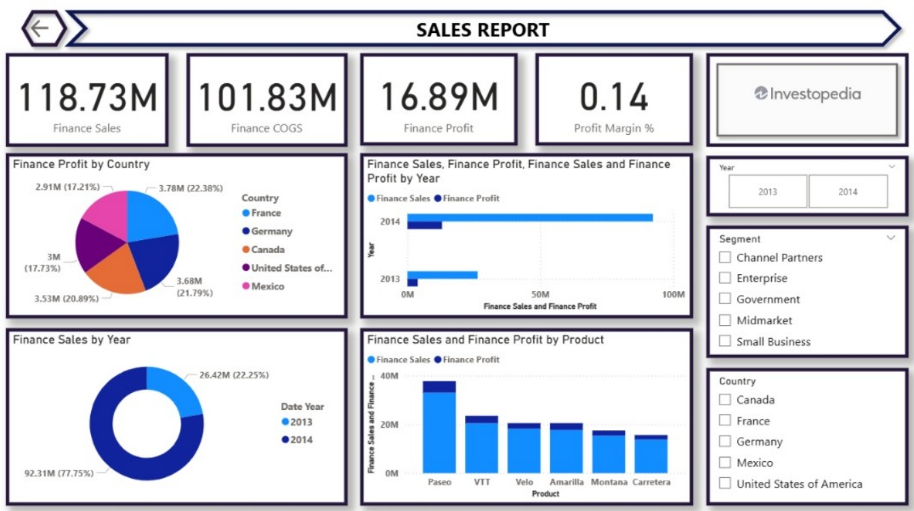

Power BI Sales Dashboard

📊 Project Overview
This project presents an interactive Power BI dashboard designed to analyze
sales performance and business KPIs.

🔍 Key Insights
- Total revenue and profit trends
- Top-performing products and regions
- Monthly sales growth analysis

🛠 Tools Used
- Power BI
- Excel
- DAX

📸 Dashboard Preview

📁 Files
- `.pbix` – Power BI dashboard file
- `.png` – Dashboard preview
